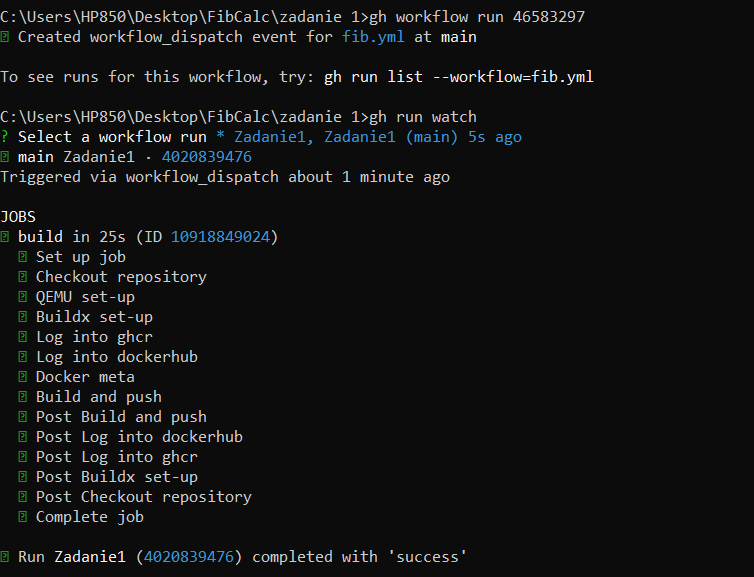

## Część obowiązkowa
### 1. 
Wykorzystany algorytm działa na bardzo prostej zasadzie dodając do siebie kolejne wyrazy w pętli. Polecenia użyte do stworzenia repozytorium na github:
```
git init -b main
git add .
git commit -m "First commit"
gh repo create FibCalc --public --source=. --remote=FibCalc --push
```

### 2.
#### B. 
Do zbudowania obrazu wykorzystałem polecenie  ```docker build -t main .```


#### C. 
Do zbudowania oraz uruchomienia obrazu wykorzystałem polecenie ```docker run -it --rm main ``` jako, że jest to aplikacja konsolowa należało wykorzystać opcje -it


### 3.
D. użyto akcji metadata, obrazy nazywane są kolejno zgodnie ze standardem semver np. 1.0.0

### 4.
#### A.
Opis fib.yml to Zadanie1 widzimy je po użyciu polecenia ```gh workflow list``` po wyświetleniu workflow za pomocą ```gh workflow view 46583297 ``` widzimy że nazwa .yml dla tego workflow to fib.yml


#### B.
Uruchamiamy GitHub Action za pomocą polecenia ```gh workflow run 46583297``` i ```gh run watch```


#### C.
Aby pobrać i uruchomić obraz można użyć komendy ```docker run -it ghcr.io/malpka8/fibcalc:latest```


repozytorium na ghcr.io: https://github.com/malpka8/FibCalc/pkgs/container/fibcalc
repozytorium docker.io: https://hub.docker.com/repository/docker/bszabat5/main/general
